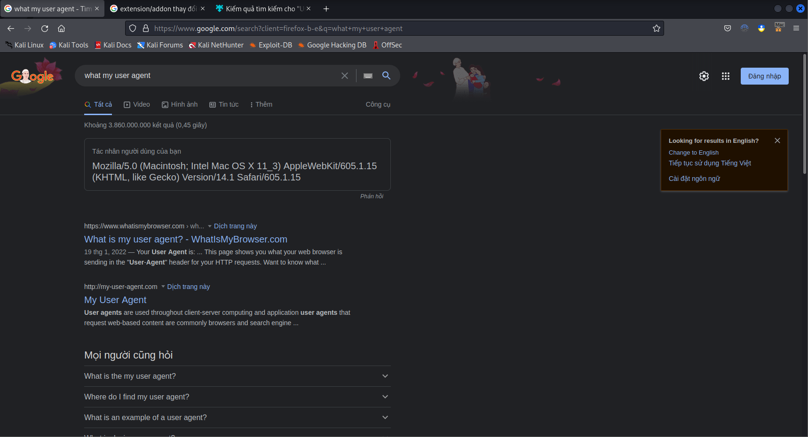

## Người thực hiện: Trần Ngọc Nam
## Ngày thực hiện: 10/5/2022

- Chrome:
  - Trước khi cài extension:
    
    

  - Sau khi dùng User-Agent Switcher để chuyển qua Internet Explorer 10:
    
    

  - Sau khi dùng User-Agent Switcher and Manager để chuyển qua UC Browser trên Android 7.0:
    
    

  - Cuối cùng có thể dùng Random User-Agent:
    
    

- Firefox:
  - Trước khi cài extension:
   
    

  - Sau khi dùng User-Agent Switcher để chuyển qua Chrome Windows:
  
    

  - Sau khi dùng User-Agent Switcher and Manager để chuyển qua Safari trên Mac OS:

    

  - Cuối cùng có thể dùng Random User-Agent:
  
    
    