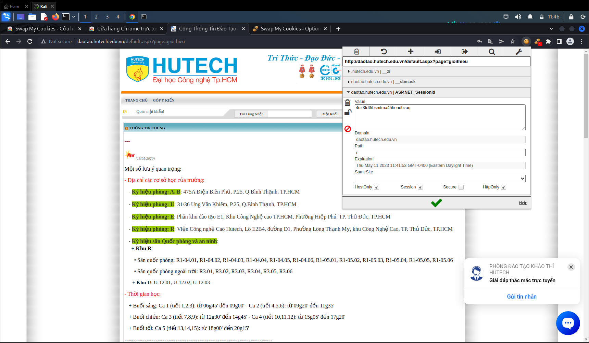
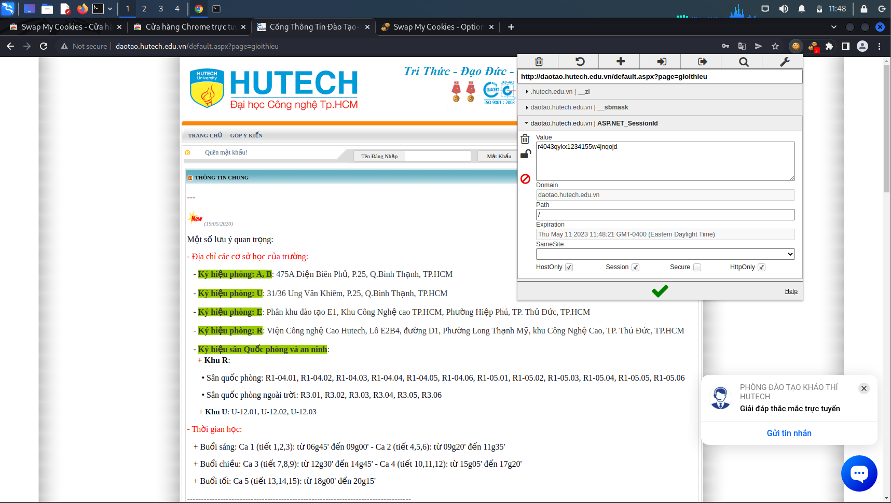

## Người thực hiện: Trần Ngọc Nam
## Ngày thực hiện: 11/5/2022

- Lần này, ta dùng extension <code>EditThisCode</code> để xem cookie và <code>Swap My Cookies</code> để dễ dàng thay đổi qua lại giữa các cookie.
- Ví dụ:
  - Đây là cookie của user1:
    
    

  - Và chỉ cần 1 cú click chuột vào <code>Swap My Cookies</code>, ta có thể dễ dàng chuyển qua cookie của user 2 hoặc 3 tùy ý.

    

    