## Người thực hiện: Trần Ngọc Nam
## Ngày thực hiện: 10/5/2022

# Mục lục:
1. [Sitemap là gì?](#1)
2. [Các loại Sitemap](#2)
	1. [HTML Sitemap](#3)
	2. [XML Sitemap](#4)
	3. [Các loại Sitemap khác](#5)
3. [Tại sao cần dùng Sitemap](#6)
	1. [HTML Sitemap dành cho người dùng có thể đem lại lợi ích cho SEO](#7)
	2. [Các website cần dùng XML Sitemap](#8)
4. [Cách xem Sitemap của website](#9)
5. [Hướng dẫn tạo Sitemap cho website](#10)
	1. [Cách tạo HTML Sitemap](#11)
	2. [Cách tạo XML Sitemap](#12)
	3. [Khai báo Sitemap của bạn đến Google](#13)
6. [Có nên tách nhỏ Sitemap?](#14)
	1. [Vì sao nên tách nhỏ Sitemap?](#15)
	2. [Chia nhỏ Sitemap như thế nào?](#16)

## Sitemap là gì?
- Sitemap (sơ đồ website) là một file liệt kê các trang và tệp tin trên website.
- Danh sách liệt kê được sắp xếp theo dạng sơ đồ phân tầng (giảm dần sự quan trọng) giúp các công cụ tìm kiếm:
  - Thu thập dữ liệu trên trang web của bạn hiệu quả hơn.
  - Biết những URL nào bạn muốn ưu tiên xuất hiện.
  - Hiển thị kết quả trên trang tìm kiếm thông minh hơn.
  
  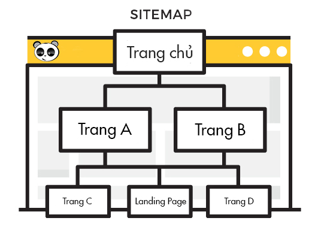

## Các loại Sitemap:

### HTML Sitemap:
- HTML Sitemap là sơ đồ website xây dựng bằng mã HTML giúp cho người dùng dễ tiếp cận mục họ đang tìm hơn.
- HTML Sitemap nên được đặt ở phần Footer để người dùng dễ tìm thấy nhất.
  
  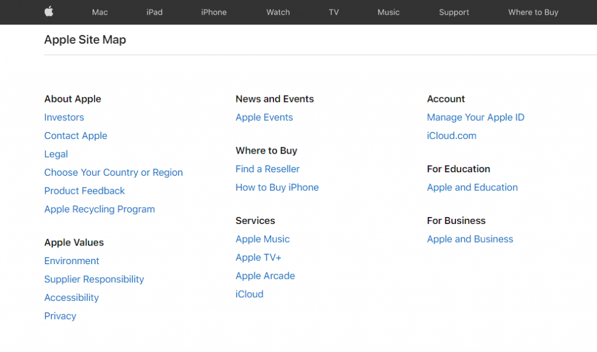

### XML Sitemap:
- XML Sitemap được tạo nên với mục đích giúp bot của các công cụ tìm kiếm định hướng và thu nhập thông tin trên website dễ dàng, nhanh chóng hơn.
  
  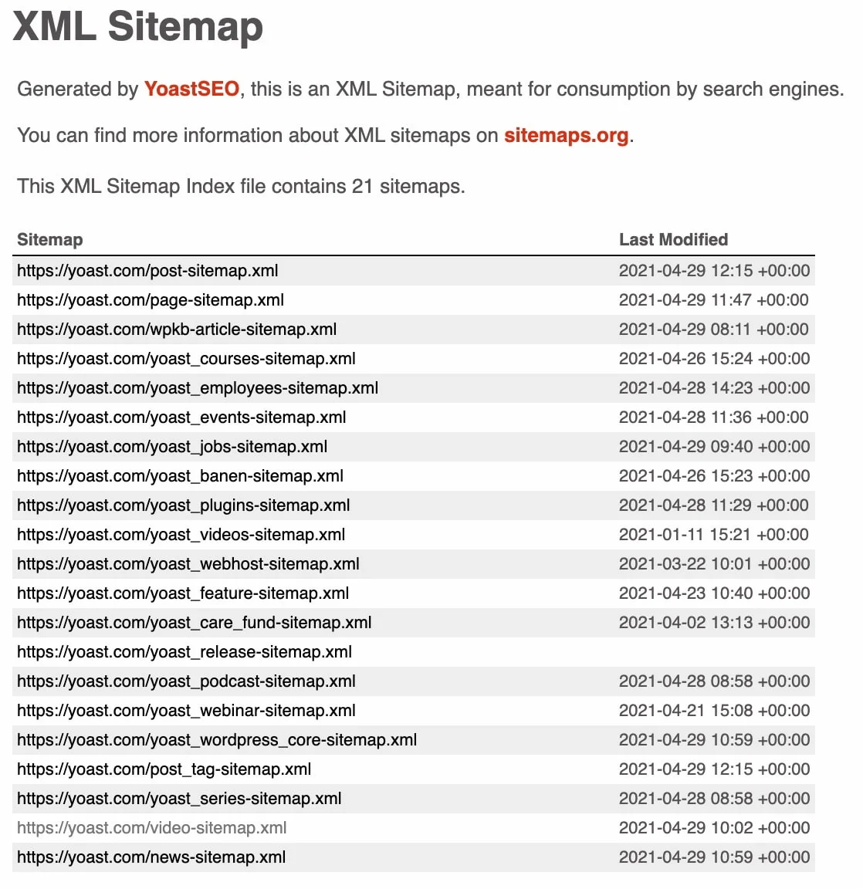

### Các loại Sitemap khác:
- Sitemap Index: Tập hợp các Sitemap được đính kèm và được dùng để đặt trong file robots.txt
- Sitemap-category.xml: Tập hợp cấu trúc của các danh mục trên website.
- Sitemap-products.xml: Sitemap dành cho các link chi tiết về các sản phẩm trên trang.
- Sitemap-articles.xml: Sitemap dành cho các link chi tiết của từng bài viết trên website.
- Sitemap-tags.xml: Sitemap dành cho các thẻ trên website.
- Sitemap-video.xml: Sitemap dành riêng cho video trên các page, website.
- Sitemap-image.xml: Sitemap dành cho các link về hình ảnh.

## Tại sao cần dùng Sitemap:

### HTML Sitemap dành cho người dùng có thể đem lại lợi ích cho SEO:
- Giúp người dùng dễ sử dụng website hơn, là một trong những yếu tố được Google đánh giá cao vì Google đã khẳng định rằng trải nghiệm người dùng tốt sẽ ảnh hưởng tích cực đến thứ hạng của bạn trên trang tìm kiếm.
- Không chỉ vậy có thêm sự xuất hiện của các keywords chính giúp bạn có thêm lợi thế cạnh tranh thứ hạng.
- Ảnh hưởng đến quá trình SEO.
- Giúp Google index website mới nhanh hơn.
- Hỗ trợ trải nghiệm người dùng khi website có sitemap.
  
### Các website cần dùng XML Sitemap:
- Các website mới hoặc website đã có nhiều nội dung nhưng không xây dựng hệ thống link liên kết nội bộ (internal link) nên tạo XML Sitemap ngay để được Google Index (lập chỉ mục) nhanh hơn.
- Một website thương mại điện tử sở hữu nhiều danh mục lớn và hàng trăm danh mục con. Tạo sitemap cho website sẽ giúp bot crawl hiệu quả hơn và hiển thị kết quả tìm kiếm sản phẩm chính xác hơn.
- Nếu bài viết của bạn bị copy hoặc được dùng để trích dẫn cho nhiều website thì Sitemap có thể chứng minh cho Google rằng bài viết của bạn là bài viết gốc với các thông tin lưu trữ tại Sitemap.

## Cách xem sitemap của website:
- Bạn có thể xem sitemap của website bằng cách thêm sitemap.xml vào phần đuôi của địa chỉ website.
- VD: https://www.example.com/sitemap.xml
  
  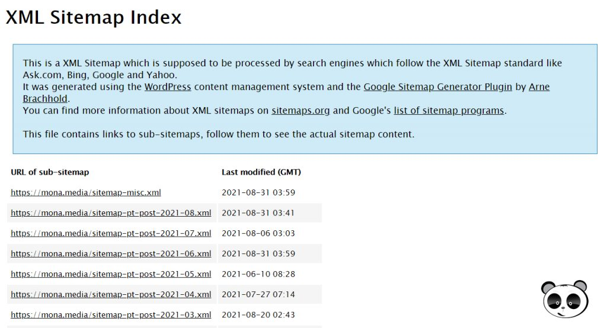

- Nếu website không trả về kết quả (giao diện khác nhau tùy website) nghĩa là bạn vẫn chưa tạo file sitemap.

## Hướng dẫn cách tạo Sitemap cho website:

### Cách tạo HTML Sitemap:
- Tạo HTML Sitemap cho WordPress: Với Website WordPress thì plugin Simple Sitemap là giải pháp tối ưu nhất.
  
  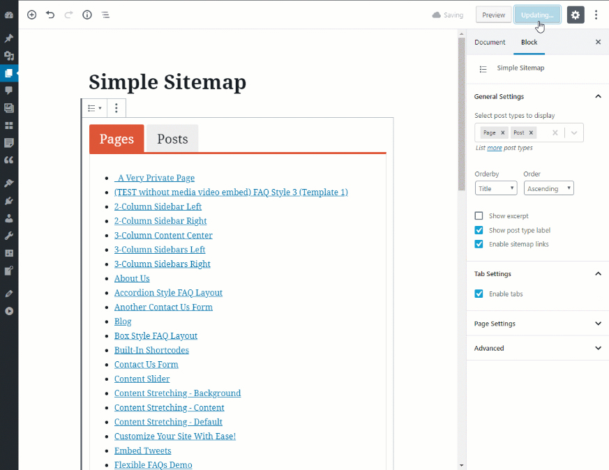

- Tạo HTML Sitemap thủ công: Ta có thể sử dụng các tag <code>ol</code> hoặc <code>ul</code> kết hợp với CSS để có HTML Sitemap đúng ý nhất.
  
### Cách tạo XML Sitemap:
- Tạo XML Sitemap cho Website WordPress:
  - Bước 1: Cài đặt và kích hoạt Yoast SEO
    
    

  - Bước 2: Mở cài đặt nâng cao cho các trang
    - Chọn Yoast SEO ở thanh điều khiển -> Dashboard
    - Chọn tab Features -> Advanced setting pages -> chuyển sang Enabled để kích hoạt tính năng chỉnh sửa nâng cao
    
    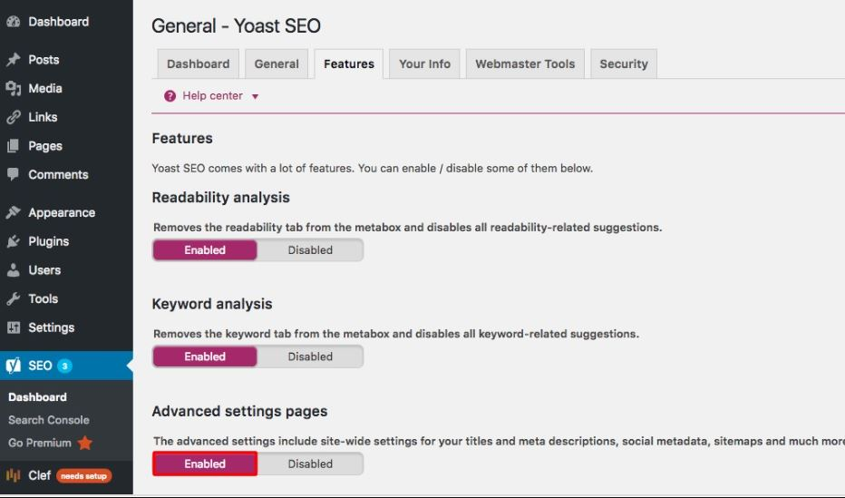

  - Bước 3: Kích hoạt XML Sitemap
    - Chọn vào mục XML Sitemaps mới xuất hiện ở thanh điều khiển
    - Chuyển sang Enabled để kích hoạt XML Sitemaps.

    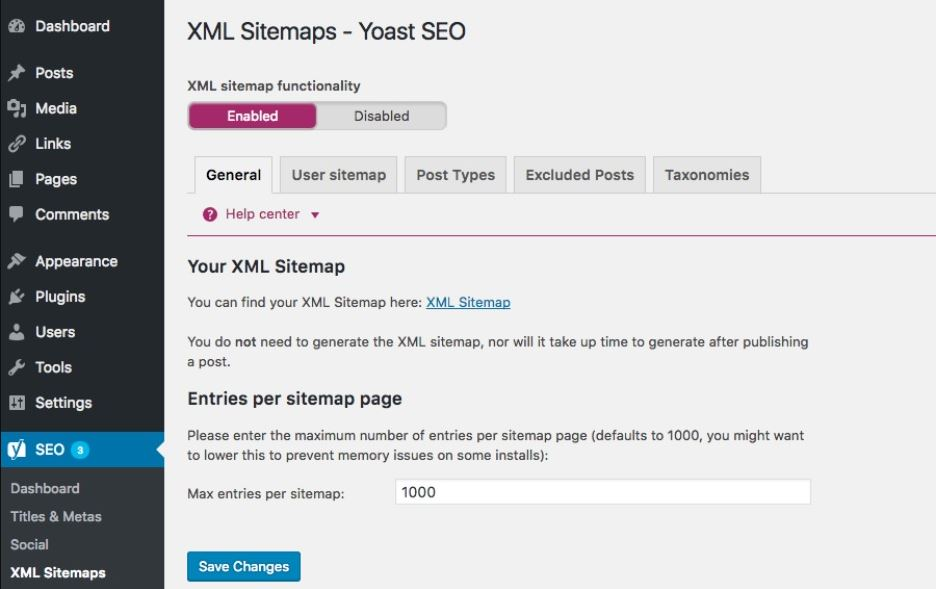

  - Bước 4: Kiểm tra: Kiểm tra XML Sitemap bằng cách thêm sitemap.xml vào cuối domain.
  
    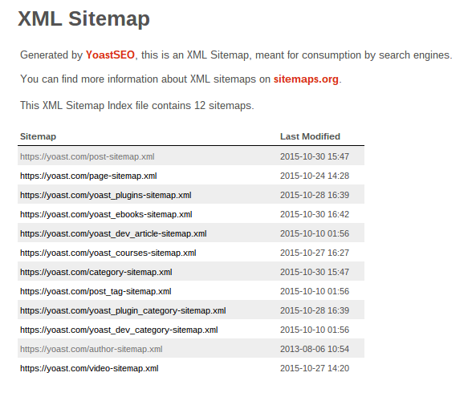

- Tạo XML Sitemap bằng công cụ Online XML-Sitemaps.com:
  - Bước 1: Truy cập vào website http://www.xml-sitemaps.com/

    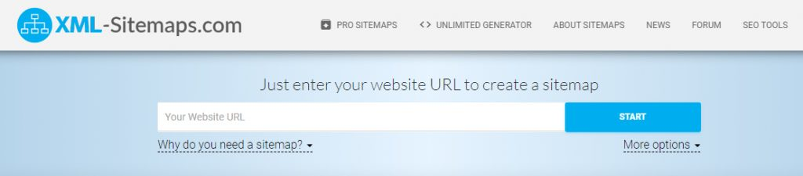

  - Bước 2: Nhập URL và chọn Start: Ta có thể bật/tắt một số tùy chọn trước khi bắt đầu:
    - Tự động tính toán mức độ ưu tiên
    - Bao gồm thông tin của lần thu nhập dữ liệu gần nhất
    
    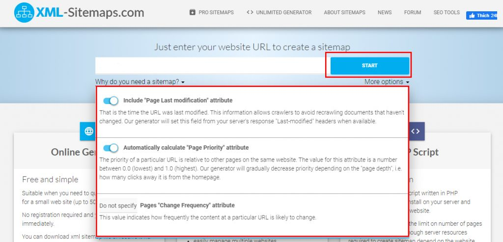
  
  - Bước 3: Sau khi quá trình xử lý kết thúc -> chọn View Sitemap Details
  
    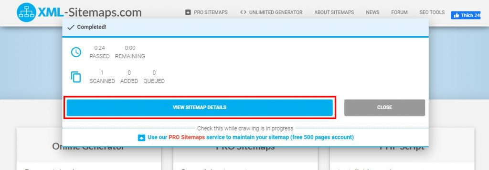

  - Bước 4: Tải Sitemap về
  
    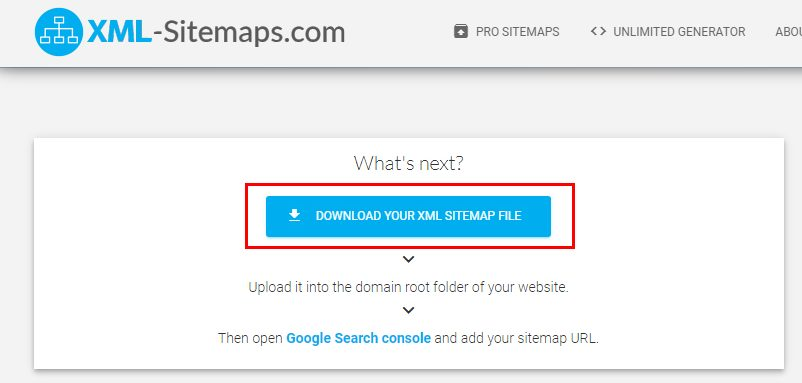

  - Bước 5: Upload file XML lên host tại thư mục của website và kiểm tra với URL www.example.com/sitemap.xml

### Khai báo Sitemap của bạn đến Google:
- Bước 1: Truy cập vào tài khoản Google Search Console đã xác minh quyền sở hữu tên miền website của bạn
- Bước 2: Chọn mục Sitemaps (sơ đồ trang web) -> nhập đoạn URL trỏ về sitemap (thường là sitemap.xml) -> Submit.
  
  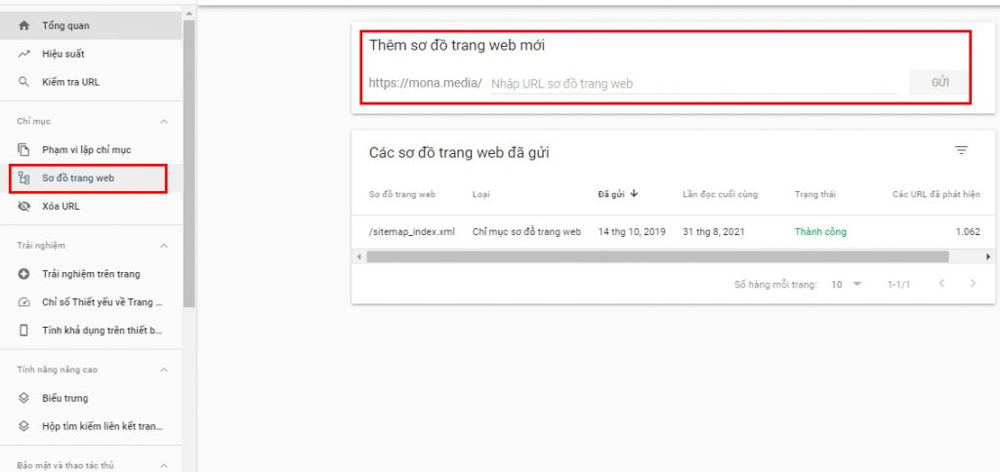

- Bước 3: Sau khi submit, Google sẽ crawl toàn bộ website theo sitemap.
  - Nếu không trang nào có lỗi, thì sẽ thông báo trạng thái thành công
    
    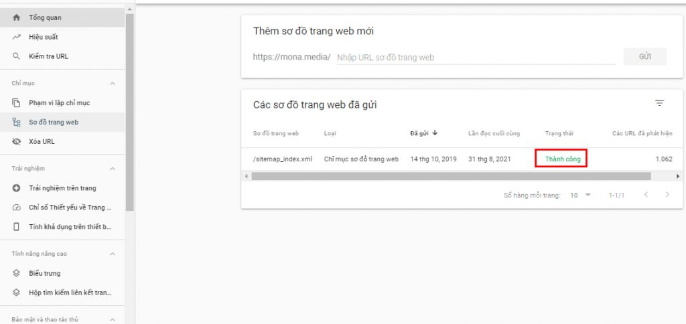

  - Nếu gặp lỗi trong quá trình submit thì Google Search Console sẽ thông báo các lỗi phát hiện được để bạn có thể chỉnh sửa và submit lại.
  
    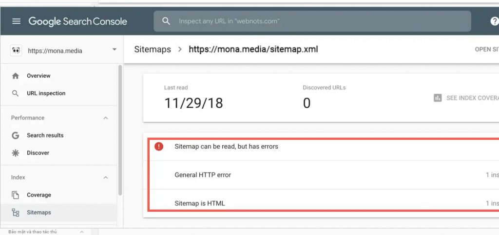

- Sau khi Submit thành công thì, file sitemap sẽ giúp cho website được thay đổi cách crawl từ bot cho phù hợp hơn.
- Bên cạnh đó file sitemap còn có thể tự động cập nhật và lưu trữ các thông tin:
  - Tần suất mỗi trang được cập nhật
  - Khi các trang được thay đổi lần cuối
  - Các trang quan trọng nên thường xuyên crawl

- Tuy nhiên với các trang hoặc bài viết rất quan trọng và bạn muốn được Google Index (lập chỉ mục) nhanh nhất có thể thì hãy trực tiếp Submit URL lên Google để được vào hàng chờ ưu tiên

## Có nên tách nhỏ Sitemap?

### Vì sao nên tách nhỏ Sitemap?
- Việc tách nhỏ Sitemap để tăng tốc cho Google.
- Chia nhỏ Sitemap có thể tiết kiệm băng thông, đồng thời để Google quét chúng với tốc độ nhanh nhất.

### Chia nhỏ Sitemap như thế nào?
- Hãy chia khoảng 500 link cho mỗi Sitemap nếu sử dụng các plugin tạo Sitemap hoặc nếu chúng có cấu hình chia nhỏ Sitemap.
- Ngoài ra, có thể chia nhỏ Sitemap theo phân loại nội dung: Sitemap bài viết, Sitemap video, Sitemap category, Sitemap ảnh,…
  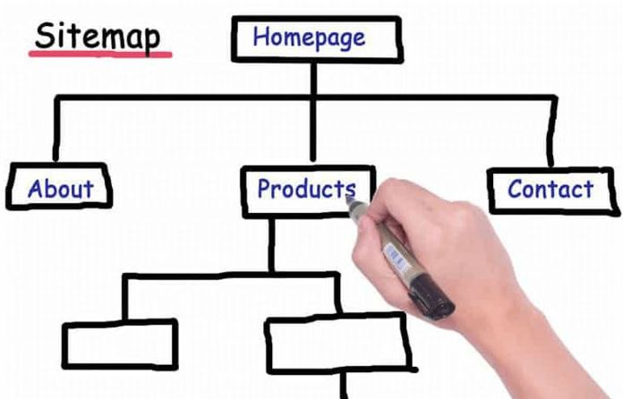
